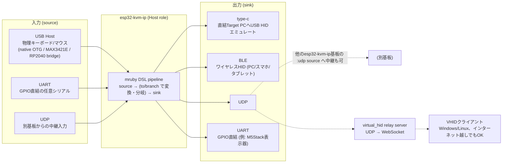

# ワイヤレスUSB HID

USB HID機器(複数、HUB経由)をワイヤレス化したい。中心となるのは`esp32-kvm-ip/`
(Host role) - 物理キーボード/マウスやUART越しの何かを読み取り、本体に書き込んだ
mrubyスクリプトの`source`/`sink`/`pipeline` DSLで好きな出力先へ自在にルーティングする。
何をどこへ流すかはケーブルではなくスクリプトの数行で決まる。

*(旧版のREADMEは[`mds/archive/README_legacy_2026-09-14.md`](mds/archive/README_legacy_2026-09-14.md)に退避。)*

## 全体像 (esp32-kvm-ip, Host role)



1枚の基板が同時に複数のsource/sinkを持てる。「物理キーボードをtype-cとBLE両方に同時出力」
「UART越しのログをUDPで無線飛ばし」「別基板から受けたUDPイベントをそのままtype-cへ」も、
全部同じDSLの組み合わせで表現する。Device role(`KVM_ROLE=DEVICE`、単体のUSB HIDリレー専用
ビルド)は**deprecated** - Host role単体で従来のDevice role相当の動作も含め全部できる。

## mrubyでこんなことができる

`esp32-kvm-ip/main/mruby_scripts/default.rb`(内蔵)または実行時アップロードしたスクリプト
(WebUIか`bin/upload_mruby_script.py`、どちらもリビルド不要)が実際の配線を決める:

```ruby
# 物理キーボード/マウスを読み取る
source :kbd,   :usb_host, kind: :keyboard
source :mouse, :usb_host, kind: :mouse
# ついでに、別のUART機器(例: 何かのデバッグログ)も無線ロガー化
source :dbg,   :uart, rx: 4, baud: 115200

# 出力先: 直結Target PC(type-c)とBLE(スマホ/タブレット等)に同時出力
sink :typec_kbd,   :typec, kind: :keyboard
sink :typec_mouse, :typec, kind: :mouse
sink :phone_kbd,   :ble,   kind: :keyboard
# UARTログはPC上のnetcat等へUDPでそのまま無線中継
sink :log_pc, :udp, host: "192.168.1.50", port: 9001

# キーボードはtype-c・BLE両方に素通し(1入力→2出力のfan-out)
pipeline(:keyboard) { from :kbd; to :typec_kbd, :phone_kbd }

# マウスはtype-cへ - ただしホイールはブロックして誤爆防止
pipeline :mouse do
  from :mouse
  to :typec_mouse do |ev|
    ev[:wheel] = 0
    ev
  end
end

# UARTの生バイト列をそのままUDPへ無線リレー(無線シリアルロガー)
pipeline(:uart_log) { from :dbg; to :log_pc }
```

- `to`ブロックは変換付き接続(返り値を送信、`nil`でその回だけdrop)
- `branch`は無加工の条件付き接続(真偽値だけ返し、ヒットしたら元のイベントをそのまま転送)
- `:usb_host`/`:typec`/`:ble`のkeyboard/mouse/consumer/system_controlイベントはSymbolキーのHash、
  `:uart`のイベントは生バイト列のString - `to`ブロックがHashを返せば`:typec`/`:ble`宛にキー入力を
  「合成」することもできる(UART越しの独自プロトコルをデコードしてキーストロークにする、など)

もっと具体的な例は`esp32-kvm-ip/main/mruby_scripts/examples/`に
(`wheel_to_udp_only.rb`、`uart_logger.rb`、`key_remap.rb`、`device_role_bridge.rb`)。

旧来のC版マクロ差し替え方式(`filter_rules.h`/`route_rules.h`)もコード上は残っているが、
mrubyをビルド時に無効化した場合かスクリプトの読み込みに失敗した場合の非常用fallbackに
過ぎない。通常の編集対象ではない。

## DSLリファレンス

### 配線の核 - source / sink / pipeline

| DSL | 説明 |
|---|---|
| `source :name, :type, **opts` | 入力を名前付きで宣言。`:usb_host`(要`kind:`)/`:udp`(要`listen:`)/`:uart`(要`rx:`、`port:`/`baud:`省略可) |
| `sink :name, :type, **opts` | 出力を名前付きで宣言。`:typec`/`:ble`(`kind:`省略可)/`:udp`(要`host:`,`port:`)/`:uart`(要`tx:`、`port:`/`baud:`省略可) |
| `pipeline(:name) { ... }` | `source`と`sink`を`from`/`to`/`branch`で繋ぐブロック |
| `from :source_name, kind: :xxx` | パイプラインの入力源。`:udp`source (`kind:`必須、任意種別を運べるため)以外は`kind:`省略可 |
| `to :sink_name, ... do \|ev\| ... end` | 変換付き接続。ブロック省略で素通し。`nil`を返すとその回はdrop |
| `branch :sink_name do \|ev\| ... end` | 無加工の条件付き接続。真偽値を返し、trueなら元のイベントをそのまま転送 |

### 入出力の種類

| type | 役割 | 主なオプション |
|---|---|---|
| `:usb_host` | source専用。物理USBキーボード/マウス/Consumer Control | `kind:` |
| `:typec` | sink専用。直結Target PCへのUSB HIDエミュレート | `kind:`(省略可) |
| `:ble` | sink専用。BLE HID(NimBLE、複数ペア対応) | `kind:`(省略可) |
| `:udp` | source/sink両対応。ネットワーク中継 | source: `listen:` / sink: `host:`, `port:` |
| `:uart` | source/sink両対応。GPIO直結の任意シリアル | source: `rx:` / sink: `tx:` / 共通: `port:`, `baud:` |

### 設定・診断系DSL(抜粋、グループ別)

| グループ | DSL |
|---|---|
| 起動/ネットワーク | `hostname`, `usb_host_backends`, `wifi_reconnect_restart_after`, `wifi_fast_reconnect_static_ip`, `ntp_sync`, `timezone` |
| 省電力 | `usb_suspend_wifi_sleep`, `usb_suspend_rp2040_sleep`, `rp2040_bridge_probe_retries`, `rp2040_bridge_probe_timeout_ms` |
| BLE | `ble_toggle`, `ble_dynamic`, `ble_started?`, `ble_connected?`, `ble_pair_switch`, `ble_pair_new`, `ble_pair_slot`, `ble_pair_slot_bonded?`, `ble_wifi_off_while_connected` |
| System Control出力 | `system_control :usage, *sinks` (Power Down/Sleep/Wake Up等) |
| クラッシュ安全網 | `crash_notify_url`, `crash_notify_test`, `heap_trace_start`, `heap_trace_dump`, `restart`, `simulate_crash` |
| その他 | `after(ms) { }` (タイマー), `debug_print(*)`, `debug_print_to(:uart, :http)` |

## ファームウェア更新(Host role、WiFi OTA)

スクリプト/WebUI frontendだけでなく、ビルドしたアプリイメージ本体もケーブル無しで書き換えられる
(`ota_0`/`ota_1`の2枠構成 + ロールバック - 新イメージが起動確認前にクラッシュ/リセットすると
前のスロットへ自動で戻る)。

- WebUI: 「Update firmware」でファイル選択(`build.host/esp32-kvm-ip.bin`)→アップロード(自動で再起動して反映)
- CLI: `bin/upload_firmware.py --host <IPまたはhostname> [path/to/esp32-kvm-ip.bin]`(省略時`esp32-kvm-ip/build.host/esp32-kvm-ip.bin`)
- `bin/build_host.sh flash -p <値>`は`<値>`がシリアルデバイス風(`/dev/...`, `COM<N>`)ならこれまで通りシリアル書き込み、そうでなければ(IP/hostname)自動的にWiFi OTAへ切り替わる

## 他のサブプロジェクト

- **`virtual_hid/`**: esp32-kvm-ip系とは独立した別プロジェクト。UDPで届くHIDパケットをサーバー(Ruby)
  がWebSocketでグローバルに中継し、クライアント(.NET, Windows/Linux)がOSに対してバーチャルHIDとして
  入力する。上の全体像図のUDP出力先の1つ。詳細は`virtual_hid/README.md`、設計背景は`mds/virtual_hid/overview.md`
- **`rp2040_host_check/`**: RP2040によるUSB Hostクロステスト(調査用)
- **`wireshark_9btn_mouse/`**: USBキャプチャ解析(調査用)
- **`rp2040_host_bridge/`**: RP2040 UART USB Hostバックエンドのファームウェア(esp32-kvm-ip Host role
  から利用される)

## debug print類の場所

- `esp32-kvm-ip/main/usb_host_rp2040_bridge.c`: `BRIDGE_RATE_MONITOR`(受信rate/interval統計)、`BRIDGE_MINIMAL_TEST`(WiFi/type-c/dispatch_task抜きの最小構成ビルド)
- `esp32-kvm-ip/main/usb_device_typec.c`: `USB_DEVICE_TYPEC_DEBUG`(送信毎ログ)、`USB_DEVICE_TYPEC_RATE_MONITOR`(wait_for_ready blocking統計)
- `esp32-kvm-ip/main/main_host.c`: `HOST_MINIMAL_TEST`(WiFi/type-c/hid_forwarder抜きの最小構成ビルド)
- `rp2040_host_bridge/rp2040_host_bridge.ino`: `BRIDGE_DEBUG`、`RATE_MONITOR`、`POLL_CEILING_TEST`
- `rp2040_host_check/rp2040_host_check.ino`: `RAW_DUMP`、`RATE_MONITOR`
- いずれも該当ファイル冒頭付近の`#define ... 0`を`1`にして有効化

## 詳細(mds/へのリンク)

- 設計思想・DSL全体設計: [`mds/usb_hid/2026-08-28_mruby_filter_route.md`](mds/usb_hid/2026-08-28_mruby_filter_route.md)
- DSL実装・Event Hashリファレンス: [`mds/usb_hid/2026-08-29_mruby_phase1_impl.md`](mds/usb_hid/2026-08-29_mruby_phase1_impl.md)
- WebUI(スクリプト編集/ログ/クラッシュ表示): [`mds/usb_hid/2026-08-30_mruby_phase2_webui.md`](mds/usb_hid/2026-08-30_mruby_phase2_webui.md)
- WiFi OTA: [`mds/usb_hid/2026-09-10_wifi_ota.md`](mds/usb_hid/2026-09-10_wifi_ota.md)
- BLE HID sink: [`mds/usb_hid/2026-09-07_ble_hid_sink_plan.md`](mds/usb_hid/2026-09-07_ble_hid_sink_plan.md)
- BLE複数ペア: [`mds/usb_hid/2026-09-12_ble_multi_pair.md`](mds/usb_hid/2026-09-12_ble_multi_pair.md)
- UARTブリッジ: [`mds/usb_hid/2026-09-14_uart_bridge.md`](mds/usb_hid/2026-09-14_uart_bridge.md)
- クラッシュ安全網(coredump/WebUI/ntfy): [`mds/usb_hid/2026-09-13_crash_reporting.md`](mds/usb_hid/2026-09-13_crash_reporting.md)
- virtual_hid設計背景: [`mds/virtual_hid/overview.md`](mds/virtual_hid/overview.md)
